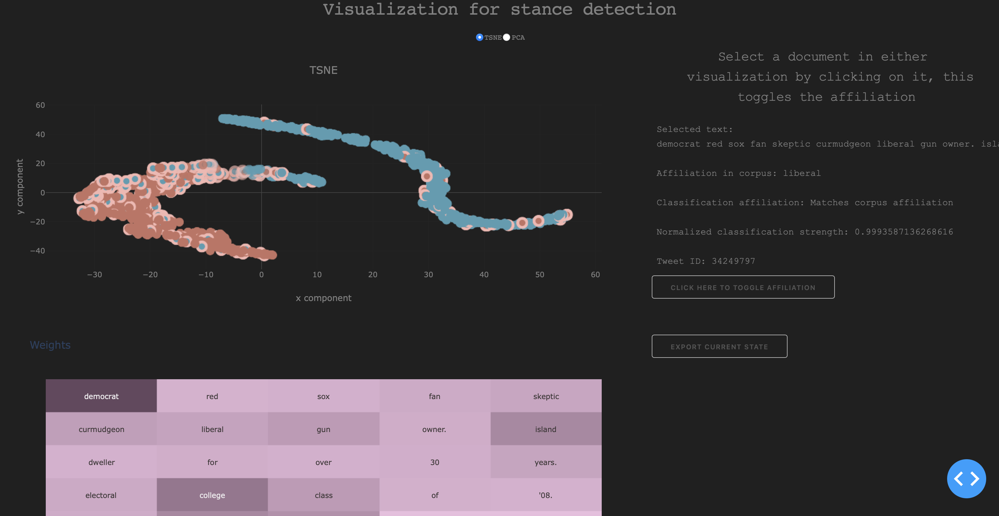

## About

This repo contains some of the source code for the work 'Stance detection from weakly-supervised text'. This work attempts to learn projections from short documentsthrough language model embeddings. 

The folder structure is as follows:

```
├── Airflow_scripts           <---------- Airflow scripts for job orchestration     
│   ├── generate_graphs_remote.py
│   ├── plotting.py
│   ├── pytorch_attention_rnn_runner.py
│   ├── pytorch_elmo_runner.py
│   └── pytorch_rnn.py.
├── App                        <--------- Web app in Plot.ly Dash
│   ├── README
│   └── vis.py
├── Elmo_pytorch.py            <--------- Pytorch code with Elmo embeddings for stance extraction 
├── README.md
├── RQ                         <--------- Tweet downloader
│   ├── README.md
│   ├── job.py
│   ├── job_submission.py
│   └── logging_mod.py
├── app.png
└── attention_pytorch_opt.py   <-------- Pytorch code for stance with hyperparameter optimization with comet (No Elmo)
```


